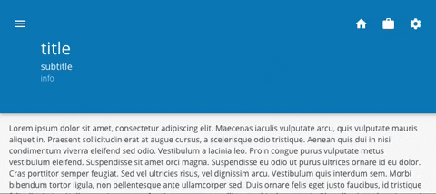

# App Bar

The `<AppBar>` component is an extension of the default AppBar from Material UI that can be resized / collapsed as the page is scrolled.

<div style="width: 100%; text-align: center">
    
</div>

It supports three variants:

-   Snap: Automatically switches between the `expandedHeight` and the `collapsedHeight` once the window is scrolled past the `scrollThreshold`.
-   Collapsed: Stays permanently fixed at the `collapsedHeight` (like a standard AppBar).
-   Expanded: Stays permanently fixed at the `expandedHeight`.

## Usage

<div style="width: 100%; text-align: center">
    
    
</div>

```tsx
import { AppBar, ThreeLiner } from '@brightlayer-ui/react-components';
...
// Default: AppBar will resize between expandedHeight and collapsed height when the window is scrolled past the scrollThreshold
<AppBar variant={'snap'}>
  {/* Contents */}
</AppBar>

// AppBar will stay fixed at the collapsedHeight size
<AppBar variant={'collapsed'}>
  {/* Contents */}
</AppBar>

// AppBar will stay fixed at the expandedHeight size
<AppBar variant={'expanded'}>
  {/* Contents */}
</AppBar>

// AppBar with ThreeLiner component
<AppBar variant={'snap'}>
  <Toolbar>
    <ThreeLiner
      title={'title'}
      subtitle={'subtitle'}
      info={'info'}
    ></ThreeLiner>
  </Toolbar>
</AppBar>
```

## API

<div style="overflow: auto;">

| Prop Name         | Description                                      | Type                                      | Required | Default       |
| ----------------- | ------------------------------------------------ | ----------------------------------------- | -------- | ------------- |
| animationDuration | Length of the collapse / expand animation (ms)   | `number`                                  | no       | theme default |
| backgroundImage   | Image to use as the app bar background           | `string`                                  | no       |               |
| classes           | Style Overrides                                  | `AppBarClasses`                           | no       |               |
| collapsedHeight   | Height of the AppBar when collapsed              | `number` \| `string`                      | no       | theme default |
| expandedHeight    | Height of the AppBar when expanded               | `number` \| `string`                      | no       | 200           |
| scrollContainerId | ID of the scrollable element                     | `string`                                  | no       | `window`      |
| scrollThreshold   | Distance to scroll before collapsing the app bar | `number`                                  | no       | 136           |
| variant           | Behavior of the App Bar                          | `'expanded'` \| `'collapsed'` \| `'snap'` | no       | 'snap'        |

</div>

Any other props supplied will be provided to the root element ([`AppBar`](https://material-ui.com/api/app-bar/)).

### Style Overrides

You can override the default styles used by Brightlayer UI by:

-   using the `sx` prop
-   passing a `classes` prop with keys from the `Name` column below
-   using the `Global CSS Class` in your main stylesheet

For more details on styling options check out our [Styling Guide](https://github.com/brightlayer-ui/react-component-library/tree/master/docs#style-guide).

| Name               | Global CSS Class               | Description                                          |
| ------------------ | ------------------------------ | ---------------------------------------------------- |
| root               | .BluiAppBar-root               | Styles applied to the root element                   |
| background         | .BluiAppBar-background         | Styles applied to the background image               |
| expanded           | .BluiAppBar-expanded \*        | Styles applied to the root element when expanded     |
| collapsed          | .BluiAppBar-collapsed          | Styles applied to the root element when collapsed    |
| expandedBackground | .BluiAppBar-expandedBackground | Styles applied to the background image when expanded |

> \* These classes can not be overridden via the `sx` prop.
