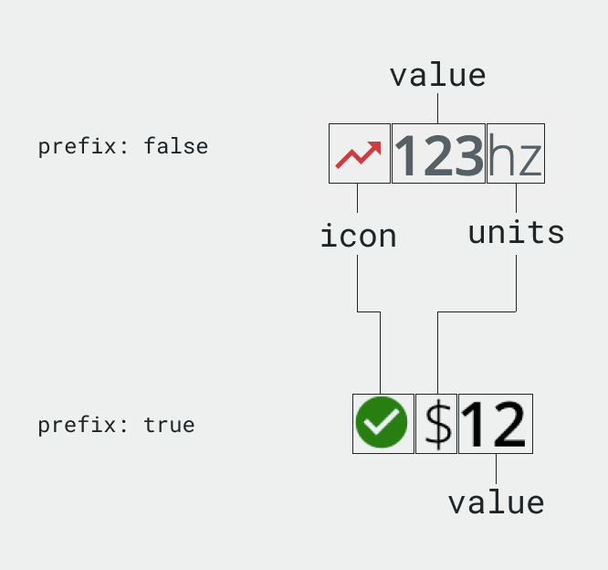

# ChannelValue
The ChannelValue component is used to display...a channel value (and units). This component abstracts the styles used to display the channel and units as well as an optional inline icon. These are used as part of the [Hero](./Hero.md) component, but can also be used inline (e.g., in a list).

<div style="text-align:center; width: 100%">
    
    <hr />
    
</div>


## Usage

<div style="text-align:center; width: 100%">
    
</div>

```typescript
import { ChannelValue } from '@pxblue/react-components';
...
<ChannelValue value={100} unit={'%'} icon={<Icon/>} />
```

### API
<div style="overflow: auto;">

| Prop Name   | Description                                    | Type                     | Required | Default   |
|-------------|------------------------------------------------|--------------------------|----------|-----------|
| value       | The the value (bold text) to display           | `string` \| `number`     | yes      |           |
| unit        | The text to display for the unit (light text)  | `string`                 | no       |           |
| icon        | The inline icon to display                     | `React.Component`        | no       |           |
| prefix      | Show units before the value                    | `boolean`                | no       | false     |
| fontSize    | The size of the font                           | `string` \| `number`     | no       | 'inherit' |
| color       | The color of the font                          | `string`                 | no       | 'inherit' |

</div>
