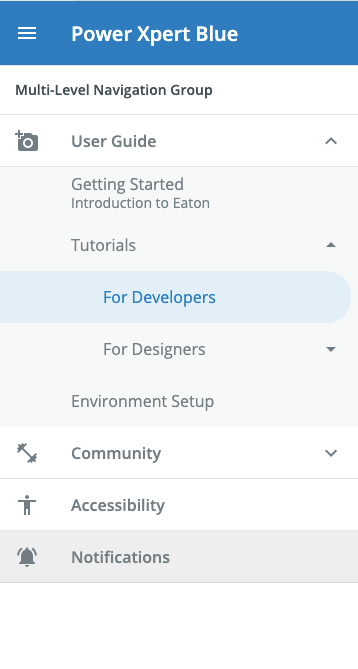
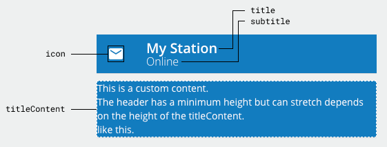
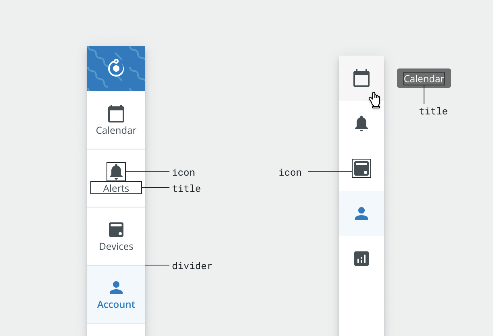

# Drawer

The `<Drawer>` component is a wrapper around the [Material UI Drawer](https://material-ui.com/api/drawer/) that adds specific Brightlayer UI functionality and styling. It is used to organize content (typically navigation links) in a collapsible side panel. The Brightlayer UI Drawer includes helper components for `<DrawerHeader>`, `<DrawerSubheader>`, `<DrawerBody>`, `<DrawerNavGroup>`, `<DrawerNavItem>`, `<DrawerRailItem>`, `<DrawerFooter>`, and `<DrawerLayout>` to help organize the content.

<div style="width: 100%; text-align: center">
    
</div>

## Drawer

The `<Drawer>` component is the parent container, which manages the overall state of the drawer and renders the child components.

<div style="width: 100%; text-align: center">
    
</div>

### Drawer Usage

```tsx
import { Drawer, DrawerHeader, DrawerSubheader, DrawerBody, DrawerNavGroup, DrawerFooter } from '@brightlayer-ui/react-components';

// Constructing the drawer using the items object
<Drawer>
    <DrawerHeader />
    <DrawerSubheader />
    <DrawerBody>
        <DrawerNavGroup items={[]}/>
        <DrawerNavGroup items={[]}/>
    </DrawerBody>
    <DrawerFooter />
</Drawer>

// Constructing the drawer declaratively
<Drawer>
    <DrawerHeader />
    <DrawerSubheader />
    <DrawerBody>
        <DrawerNavGroup>
            <DrawerNavItem />
            <DrawerNavItem>
                <DrawerNavItem />
                <DrawerNavItem />
            </DrawerNavItem>
        </DrawerNavGroup>
    </DrawerBody>
    <DrawerFooter />
</Drawer>

// a responsive Drawer using the variant prop
import { useMediaQuery } from '@material-ui/core';
import { useTheme } from '@material-ui/core/styles';
const theme = useTheme();
const xsDown = useMediaQuery(theme.breakpoints.down('xs'));

<Drawer
    variant={xsDown ? 'temporary' : 'persistent'}
>
</Drawer>
```

### Drawer API

<div style="overflow: auto;">

| Prop Name                       | Description                                                                  | Type                                                         | Required | Default           |
| ------------------------------- | ---------------------------------------------------------------------------- | ------------------------------------------------------------ | -------- | ----------------- |
| activeItem                      | itemID for the 'active' item                                                 | `string`                                                     | no       |                   |
| classes                         | Style overrides                                                              | `DrawerClasses`                                              | no       |                   |
| condensed                       | Show condensed nav items without labels (`rail` variant only)                | `boolean`                                                    | no       | `false`           |
| noLayout                        | Set to true if used without a `<DrawerLayout>`                               | `boolean`                                                    | no       | `false`           |
| onItemSelect                    | A callback function to execute whenever an item is clicked                   | `(id: string) => void`                                       | no       |                   |
| open                            | Controls the open/closed state of the drawer                                 | `boolean`                                                    | yes      |                   |
| openOnHover                     | Automatically open the drawer on hover when closed (persistent variant only) | `boolean`                                                    | no       | `true`            |
| openOnHoverDelay                | Delay (ms) before triggering open on hover (persistent variant only)         | `number`                                                     | no       | `500`             |
| sideBorder                      | Whether to use a side border for the drawer instead of a shadow              | `boolean`                                                    | no       | `false`           |
| variant                         | The variant to use (see below)                                               | `'permanent'` \| `'persistent'` \| `'temporary'` \| `'rail'` | no       | `persistent`      |
| width                           | Sets the width of the drawer when open                                       | `number` \| `string`                                         | no       | `22.5rem (360px)` |
| [...sharedProps](#shared-props) | Props that can be set at any level in the drawer hierarchy                   | -                                                            | -        |                   |

</div>

Any other props will be provided to the root element [**Material UI Drawer**](https://material-ui.com/api/drawer/).

The `Drawer` has four `variant`s:

-   **Permanent**: Always open, even when `open` is set to false.
-   **Persistent**: When `open` is set to false, the `<Drawer>` collapses itself as a navigation rail, and hover will make it expand temporarily; when `open` is set to true, it behaves like a permanent `<Drawer>`.
-   **Temporary**: When `open` is set to false, the `<Drawer>` is hidden; when `open` is set to true, it slides in.
-   **Rail**: An always collapsed version of the `<Drawer>` that only displays an icons and titles.

> **Note on using multiple drawers**: If your application uses multiple `<Drawer>`s, each `<DrawerLayout>` will automatically adjust based on the state of the nearest `<Drawer>`. If you are using a `<Drawer>` without a `<DrawerLayout>`, you should set the `noLayout` property to true on the `<Drawer>` to prevent inadvertently affecting the styles of any `<DrawerLayout>`s.

#### Classes

You can override the classes used by Brightlayer UI by passing a `classes` prop. The Drawer supports the following keys:

| Name       | Description                                                    |
| ---------- | -------------------------------------------------------------- |
| root       | MUI Drawer style override for the root element                 |
| content    | Styles applied to the drawer content container                 |
| expanded   | Styles applied to the root element when the drawer is expanded |
| paper      | MUI Drawer style override for the underlying paper element     |
| sideBorder | Styles applied when sideBorder is set to true                  |

## Drawer Header

The `<DrawerHeader>` contains the content at the top of the `<Drawer>`. By default, it renders multiple lines of text in the Brightlayer UI style. If you supply a `titleContent`, you can render your own custom content in the title area.

<div style="width: 100%; text-align: center">
    
</div>

### Drawer Header API

<div style="overflow: auto;">

| Prop Name         | Description                                    | Type                  | Required | Default                      |
| ----------------- | ---------------------------------------------- | --------------------- | -------- | ---------------------------- |
| backgroundColor   | The color used for the background              | `string`              | no       | `theme.palette.primary.main` |
| backgroundImage   | An image to display in the header              | `string`              | no       |                              |
| backgroundOpacity | The opacity of the background image            | `number`              | no       | `0.3`                        |
| classes           | Style overrides                                | `DrawerHeaderClasses` | no       |                              |
| divider           | Optional divider which appears beneath header  | `boolean`             | no       | `false`                      |
| fontColor         | The color of the text elements                 | `string`              | no       | dynamic based on background  |
| icon              | A component to render for the icon             | `ReactNode`           | no       |                              |
| onIconClick       | A function to execute when the icon is clicked | `function`            | no       | `() => {}`                   |
| subtitle          | The text to show on the second line            | `string`              | no       |                              |
| title             | The text to show on the first line             | `string`              | no       |                              |
| titleContent      | Custom content for header title area           | `ReactNode`           | no       |                              |

</div>

Any other props will be provided to the root element [**Material UI Toolbar**](https://material-ui.com/api/toolbar/).

#### Classes

You can override the classes used by Brightlayer UI by passing a `classes` prop. The `<DrawerHeader>` supports the following keys:

| Name             | Description                                      |
| ---------------- | ------------------------------------------------ |
| root             | Styles applied to the root element               |
| background       | Styles applied to the header background          |
| content          | Styles applied to the content container          |
| navigation       | Styles applied to the icon element               |
| nonClickableIcon | Styles applied to the non-clickable icon element |
| railIcon         | Styles applied to the icon when using rail style |
| subtitle         | Styles applied to the subtitle element           |
| title            | Styles applied to the title element              |

## Drawer Subheader

The `<DrawerSubheader>` is an optional section that renders below the header and above the body of the `<Drawer>`. It can be used to support custom content (passed as children), such as filtering options or to display additional information.

### Drawer Subheader Usage

```tsx
import DrawerSubheader from '@brightlayer-ui/react-components/core/Drawer';
...
<DrawerSubheader>
    <div>Custom Subheader Content</div>
</DrawerSubheader>
```

### Drawer Subheader API

<div style="overflow: auto;">

| Prop Name             | Description                                        | Type      | Required | Default |
| --------------------- | -------------------------------------------------- | --------- | -------- | ------- |
| divider               | Optional divider which appears below the Subheader | `boolean` | no       | `true`  |
| hideContentOnCollapse | Hide subheader contents when drawer is closed      | `boolean` | no       | `true`  |

</div>

Any other props supplied will be provided to the root element (`div`).

## Drawer Body

The `<DrawerBody>` is a wrapper for the main content of the Drawer. The typical use case is to display `<DrawerNavGroup>` elements, but custom elements (e.g., for spacing) are accepted as well.

### Drawer Body Usage

```tsx
import DrawerBody from '@brightlayer-ui/react-components/core/Drawer';
...
<DrawerBody>
    <DrawerNavGroup title={'Nav Items'} items={...} />
    <DrawerNavGroup title={'More Nav Items'} items={...} />
</DrawerBody>
```

### Drawer Body API

<div style="overflow: auto;">

| Prop Name                       | Description                                                | Type                | Required | Default |
| ------------------------------- | ---------------------------------------------------------- | ------------------- | -------- | ------- |
| classes                         | Style overrides                                            | `DrawerBodyClasses` | no       |         |
| [...sharedProps](#shared-props) | Props that can be set at any level in the drawer hierarchy | -                   | -        |         |

</div>

Any other props supplied will be provided to the root element (`div`).

#### Classes

You can override the classes used by Brightlayer UI by passing a `classes` prop. The `<DrawerBody>` supports the following keys:

| Name | Description                        |
| ---- | ---------------------------------- |
| root | Styles applied to the root element |

## Drawer Nav Group

A `<DrawerNavGroup>` is used inside of the `<DrawerBody>` to organize links/content. Each group consists of an (optional) group title and a series of navigation items. Most visual props are inherited from the `<DrawerBody>` but can be overridden at the NavGroup level if desired.

The `items` property supports nested items to generate collapsible sections in the menu. This can be used to create an arbitrary tree depth, but we do not recommend going more than two levels deep in a navigation Drawer. You can also build the navigation links declaratively by passing either `<DrawerNavItem>` or `<DrawerRailItem>` children to the `<DrawerNavGroup>`.

<div style="width: 100%; text-align: center">
    
</div>

### Drawer Nav Group API

<div style="overflow: auto;">

| Prop Name                       | Description                                                | Type                    | Required | Default                     |
| ------------------------------- | ---------------------------------------------------------- | ----------------------- | -------- | --------------------------- |
| classes                         | Style overrides                                            | `DrawerNavGroupClasses` | no       |                             |
| items                           | List of items to render                                    | `NavItem[]`             | yes      |                             |
| title                           | Text to display in the group header                        | `string`                | no       |                             |
| titleColor                      | Color used for the title text                              | `string`                | no       | varies for light/dark theme |
| titleContent                    | Custom element, substitute for title                       | `ReactNode`             | no       |                             |
| titleDivider                    | Divider for the title                                      | `boolean`               | no       | true                        |
| [...sharedProps](#shared-props) | Props that can be set at any level in the drawer hierarchy | -                       | -        |                             |

</div>

Any other props will be provided to the root element [**Material UI List**](https://material-ui.com/api/list/).

#### Classes

You can override the classes used by Brightlayer UI by passing a `classes` prop. The `<DrawerNavGroup>` supports the following keys:

| Name      | Description                                  |
| --------- | -------------------------------------------- |
| root      | Styles applied to the root element           |
| title     | Styles applied to the title text element     |
| subheader | Styles applied to the List subheader element |

## Drawer Footer

The `<DrawerFooter>` is an optional section that renders at the bottom of the `<Drawer>`. It can be used to add any custom content (as children).

### Usage

```tsx
import DrawerFooter from '@brightlayer-ui/react-components/core/Drawer';
...
<DrawerFooter>
    <div>Custom Footer goes here</div>
</DrawerFooter>
```

### Drawer Footer API

<div style="overflow: auto;">

| Prop Name             | Description                                 | Type      | Required | Default |
| --------------------- | ------------------------------------------- | --------- | -------- | ------- |
| backgroundColor       | The color used for the background           | `string`  | no       |         |
| divider               | Optional divider which appears above footer | `boolean` | no       | `true`  |
| hideContentOnCollapse | Hide footer contents when drawer is closed  | `boolean` | no       | `true`  |

</div>

Any other props supplied will be provided to the root element (`div`).

## Drawer Nav Item

The `<DrawerNavItem>` is an individual line item in the `<Drawer>`. These can be generated for you by using the `items` prop of the `<DrawerNavGroup>` and passing in an array of objects with the following API. You can also create these line items by directly passing them as children to the `<DrawerNavGroup>`. Each `<DrawerNavItem>` also supports the ability to nest items (using its own `items` prop or children). When using the rail variant of the `<Drawer>`, you should use `<DrawerRailItem>` instead (see below).

<div style="width: 100%; text-align: center">
    
</div>

### Drawer Nav Item API

<div style="overflow: auto;">

| Prop Name                       | Description                                                                                                                                       | Type                      | Required | Default |
| ------------------------------- | ------------------------------------------------------------------------------------------------------------------------------------------------- | ------------------------- | -------- | ------- |
| classes                         | Style overrides                                                                                                                                   | `DrawerNavItemClasses`    | no       |         |
| depth\*                         | The nested depth of the item                                                                                                                      | `number`                  | no       | 0       |
| hidden                          | Sets whether to hide the nav item                                                                                                                 | `boolean`                 | no       |         |
| hidePadding                     | Remove left padding if no icon is used                                                                                                            | `boolean`                 | no       | false   |
| icon                            | A component to render for the left icon                                                                                                           | `JSX.Element`             | no       |         |
| isInActiveTree\*                | Sets whether the item is a parent of the currently active item (managed automatically)                                                            | `boolean`                 | no       |         |
| itemID                          | A unique identifier of the NavItem. Item will have 'active' style when this matches activeItem                                                    | `string`                  | yes      |         |
| items                           | The items nested under this item                                                                                                                  | `NestedNavItem[]`         | no       |         |
| notifyActiveParent\*            | Callback function to the parent element to update active hierarchy styles                                                                         | `(ids: string[]) => void` | no       |         |
| onClick                         | A function to execute when clicked                                                                                                                | `function`                | no       |         |
| rightComponent                  | An icon/component to display to the right                                                                                                         | `ReactNode`               | no       |         |
| statusColor                     | Status stripe and icon color                                                                                                                      | `string`                  | no       |         |
| subtitle                        | The text to show on the second line                                                                                                               | `string`                  | no       |         |
| title                           | The text to show on the first line                                                                                                                | `string`                  | yes      |         |
| disableRailTooltip              | Sets whether to disable the tooltip on hover for the condensed `rail` variant                                                                     | `boolean`                 | no       |         |
| InfoListItemProps               | Used to override [InfoListItem](https://brightlayer-ui-components.github.io/react/?path=/info/components-info-list-item--get-read-me-story) default props | `InfoListItemProps`       | no       |         |
| [...sharedProps](#shared-props) | Props that can be set at any level in the drawer hierarchy                                                                                        | -                         | -        |         |

</div>

> \*These props are managed automatically when using the `<DrawerNavItem>` inside of a `<DrawerNavGroup>`.

#### Classes

You can override the classes used by Brightlayer UI by passing a `classes` prop. The `<DrawerNavItem>` supports the following keys:

| Name             | Description                                                     |
| ---------------- | --------------------------------------------------------------- |
| root             | Styles applied to the root element wrapping the InfoListItem    |
| active           | Styles applied to the active item highlight element             |
| chevron          | Styles applied to the chevron element                           |
| expandIcon       | Styles applied to the expand/collapse icon wrapper              |
| infoListItemRoot | Styles applied to the InfoListItem root element                 |
| nestedListGroup  | Styles applied to wrapper surrounded nested children            |
| nestedTitle      | Styles applied to the title text if the item is a nested item   |
| title            | Styles applied to the title text                                |
| titleActive      | Styles applied to the title text if the item is the active item |
| ripple           | Styles applied to the ripple                                    |

### Tips

You can render the `<DrawerNavItem>` as a link by setting the `component` prop in the `InfoListItemProps` to a [`Link`](https://reactrouter.com/web/api/Link) component from `react-router-dom` (recommended), or the native HTML anchor tag `'a'`. This allows you to perform helpful actions such as opening a link in a new browser tab via right-click.

```tsx

import { Link } from 'react-router-dom';
// Using items prop
<DrawerNavGroup items={[
    itemID: 'overview',
    title: 'Overview',
    // @ts-ignore
    InfoListItemProps: { component: Link, to: '/overview' },
]}/>

// Declaratively
<DrawerNavItem
    itemID={'overview'}
    title={'Overview'}
    // @ts-ignore
    InfoListItemProps={{ component: Link, to: '/overview' }}
/>
```

## Drawer Rail Item

When using the `rail` variant of the `<Drawer>`, you should use `<DrawerRailItem>` instead of `<DrawerNavItem>`. The `<DrawerRailItem>` is a simplified version of the `<DrawerNavItem>` that renders the `icon` and `title` only. When using the `condensed` version of the `<Drawer>`, the `title` will also be hidden. The `<DrawerRailItem>` cannot be nested.

<div style="width: 100%; text-align: center">
    
</div>

### Drawer Rail Item API

<div style="overflow: auto;">

| Prop Name                       | Description                                                                                     | Type                    | Required | Default |
| ------------------------------- | ----------------------------------------------------------------------------------------------- | ----------------------- | -------- | ------- |
| classes                         | Style overrides                                                                                 | `DrawerRailItemClasses` | no       |         |
| condensed\*                     | Show condensed nav items without labels (`rail` variant only)                                   | `boolean`               | no       | `false` |
| hidden                          | Sets whether to hide the rail item                                                              | `boolean`               | no       |         |
| icon                            | A component to render for the left icon                                                         | `JSX.Element`           | yes      |         |
| itemID                          | An unique identifier of the NavItem. Item will have 'active' style when this matches activeItem | `string`                | yes      |         |
| onClick                         | A function to execute when clicked                                                              | `function`              | no       |         |
| statusColor                     | Status stripe and icon color                                                                    | `string`                | no       |         |
| title                           | The text to show on the first line                                                              | `string`                | no       |         |
| ButtonBaseProps                 | Used to override [ButtonBase](https://material-ui.com/api/button-base/) default props           | `InfoListItemProps`     | no       |         |
| disableRailTooltip              | Sets whether to disable the tooltip on hover                                                    | `boolean`               | no       |         |
| [...sharedProps](#shared-props) | Props that can be set at any level in the drawer hierarchy                                      | -                       | -        |         |

</div>

> \*These props are managed automatically when using the `<DrawerRailItem>` inside of a `<Drawer>`.

#### Classes

You can override the classes used by Brightlayer UI by passing a `classes` prop. The `<DrawerRailItem>` supports the following keys:

| Name         | Description                                                     |
| ------------ | --------------------------------------------------------------- |
| root         | Styles applied to the root element wrapping the InfoListItem    |
| active       | Styles applied to the active item highlight element             |
| condensed    | Styles applied to the root element when condensed is true       |
| divider      | Styles applied to the divider element                           |
| icon         | Styles applied to the icon wrapper                              |
| statusStripe | Styles applied to the status stripe                             |
| title        | Styles applied to the title text                                |
| titleActive  | Styles applied to the title text if the item is the active item |
| ripple       | Styles applied to the ripple                                    |

### Tips

You can render the `<DrawerRailItem>` as a link by setting the `component` prop in the `ButtonBaseProps` to a [`Link`](https://reactrouter.com/web/api/Link) component from `react-router-dom` (recommended), or the native HTML anchor tag `'a'`. This allows you to perform helpful actions such as opening a link in a new browser tab via right-click.

```tsx

import { Link } from 'react-router-dom';
// Using items prop
<DrawerNavGroup items={[
    itemID: 'overview',
    title: 'Overview',
    // @ts-ignore
    ButtonBaseProps: { component: Link, to: '/overview' },
]}/>

// Declaratively
<DrawerRailItem
    itemID={'overview'}
    title={'Overview'}
    // @ts-ignore
    ButtonBaseProps={{ component: Link, to: '/overview' }}
/>
```

## Shared Props

The following props can be set at any level in the drawer hierarchy (`<Drawer>`, `<DrawerBody>`, `<DrawerNavGroup>`, `<DrawerNavItem>`, or `<DrawerRailItem>`). If they are set on a parent, they will be used for all children. For more customization, you can set these props on individual children and they will override any value set on the parent.

<div style="overflow: auto;">

| Name                      | Description                                               | Type      | Required | Default                     |
| ------------------------- | --------------------------------------------------------- | --------- | -------- | --------------------------- |
| activeItemBackgroundColor | Background color for the 'active' item                    | `string`  | no       | varies for light/dark theme |
| activeItemFontColor       | Font color for the 'active' item                          | `string`  | no       | varies for light/dark theme |
| activeItemIconColor       | Icon color for the 'active' item                          | `string`  | no       | varies for light/dark theme |
| backgroundColor           | Color used for the background of the element              | `string`  | no       |                             |
| divider                   | Whether to show a line between all items                  | `boolean` | no       | false                       |
| itemFontColor             | The color used for the item text                          | `string`  | no       | varies for light/dark theme |
| itemIconColor             | The color used for the icon                               | `string`  | no       | varies for light/dark theme |
| ripple                    | Whether to apply material ripple effect to items on click | `boolean` | no       | true                        |

</div>

The following are additional shared props that will apply when using a non-rail variant of the `<Drawer>`. They will have no effect on `<DrawerRailItem>`s.

<div style="overflow: auto;">

| Prop Name                     | Description                                                                   | Type                    | Required | Default                                                      |
| ----------------------------- | ----------------------------------------------------------------------------- | ----------------------- | -------- | ------------------------------------------------------------ |
| activeItemBackgroundShape     | shape of the active item background highlight                                 | `'round'` \| `'square'` | no       | square                                                       |
| chevron                       | Whether to have chevrons for all menu items                                   | `boolean`               | no       |                                                              |
| chevronColor                  | Color override for the chevron icon                                           | `string`                | no       |                                                              |
| collapseIcon                  | Icon used to collapse drawer                                                  | `JSX.Element`           | no       | `expandIcon` rotated 180 degrees                             |
| expandIcon                    | Icon used to expand drawer                                                    | `JSX.Element`           | no       | `<ExpandMore />` at top-level, `<ArrowDropDown />` otherwise |
| hidePadding                   | Whether to hide the paddings reserved for menu item icons                     | `boolean`               | no       |                                                              |
| disableActiveItemParentStyles | If true, NavItems will not have a bold title when a child NavItem is selected | `boolean`               | no       | `false`                                                      |
| nestedBackgroundColor         | background color for nested menu items                                        | `string`                | no       | theme.palette.type === 'light' ? white[200] : darkBlack[100] |
| nestedDivider                 | Whether to show a line between nested menu items                              | `boolean`               | no       | false                                                        |

</div>

# Drawer Layout

The `<DrawerLayout>` component is used to provide the appropriate resizing behavior for your main application content when used in conjunction with a Brightlayer UI `<Drawer>`. It accepts a `<Drawer>` as a prop, and the main page content is passed in through child elements.

<div style="width: 100%; text-align: center">
    
</div>

## Drawer Layout Usage

```tsx
import { Drawer, DrawerLayout } from '@brightlayer-ui/react-components';
...
<DrawerLayout drawer={<Drawer ... />}>
    <>
        /* Page content goes here */
    </>
</DrawerLayout>
```

### Drawer Layout API

<div style="overflow: auto;">

| Prop Name | Description                     | Type                                 | Required | Default |
| --------- | ------------------------------- | ------------------------------------ | -------- | ------- |
| classes   | Style overrides                 | `DrawerLayoutClasses`                | no       |         |
| drawer    | Drawer component to be embedded | `ReactElement<DrawerComponentProps>` | yes      |         |

</div>

Any other props supplied will be provided to the root element (`div`).

> **Note on Scrolling**: When using client-side routing in your application, you may notice that the window scroll position does not reset when navigating to new routes. To address this issue, you will need to manually update the scroll position when new pages are loaded. If you are using React Router they have [several examples](https://reacttraining.com/react-router/web/guides/scroll-restoration) on how to implement this in your application.

#### Classes

You can override the classes used by Brightlayer UI by passing a `classes` prop. The `<DrawerLayout>` supports the following keys:

| Name     | Description                                                    |
| -------- | -------------------------------------------------------------- |
| root     | Styles applied to the root element                             |
| content  | Styles applied to the body content container                   |
| drawer   | Styles applied to the drawer container                         |
| expanded | Styles applied to the root element when the drawer is expanded |