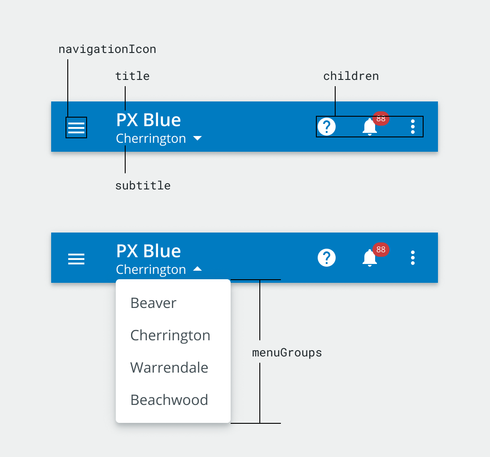

# Dropdown Toolbar

The `<DropdownToolbar>` component is used to display a toolbar with a dropdown menu for a subtitle. The Menu can be populated via the `menuGroups` prop, or can be entirely customized by supplying your own `<Menu>` via the `menu` prop.

<div style="width: 100%; text-align: center">
    
</div>

## Usage

<div style="width: 100%; text-align: center">
    
</div>

```tsx
import { DropdownToolbar } from '@brightlayer-ui/react-components';
...
<DropdownToolbar title={"Title"} subtitle={"Subtitle"} menuGroups={[
  {
    items: [{
        title: "Menu Item 1";
        onClick: () => {};
      },
      {
        title: "Menu Item 2";
        onClick: () => {};
      },
      {
        title: "Menu Item 3";
        onClick: () => {};
      }
    ]
  }
]}/>
```

## API

<div style="overflow: auto;">

| Prop Name      | Description                                | Type                     | Required | Default |
| -------------- | ------------------------------------------ | ------------------------ | -------- | ------- |
| classes        | Style Overrides                            | `DropdownToolbarClasses` | no       |         |
| menu           | Custom content to be displayed in the menu | Material-UI `Menu`       | no       |         |
| menuGroups     | Groups of menu items to display            | `ToolbarMenuGroups[]`    | no       |         |
| MenuProps      | Property overrides for the MUI Menu        | `MenuProps`              | no       |         |
| navigationIcon | Navigation Icon to be displayed            | `JSX.Element`            | no       |         |
| onClose        | Function called when the menu is closed    | `Function`               | no       |         |
| onOpen         | Function called when the menu is opened    | `Function`               | no       |         |
| subtitle       | Subtitle text to be displayed              | `string`                 | no       |         |
| title          | Title text to be displayed                 | `string`                 | yes      |         |

</div>

Any other props supplied will be provided to the root element ([`Toolbar`](https://material-ui.com/api/toolbar/)).

### Classes

You can override the classes used by Brightlayer UI by passing a `classes` prop. It supports the following keys:

| Name            | Description                                            |
| --------------- | ------------------------------------------------------ |
| root            | Styles applied to the root element                     |
| menuItem        | Styles applied to the menu item                        |
| navigation      | Styles applied to the navigationIcon                   |
| subtitle        | Styles applied to the subtitle text                    |
| subtitleContent | Styles applied to subtitle and dropdownArrow container |
| textContent     | Styles applied to title and subtitle container         |
| title           | Styles applied to the title text                       |

### Toolbar Menu Groups Object

The `menuGroups` prop of the `<DropdownToolbar>` includes many properties from the [`<DrawerNavGroup>`](https://brightlayer-ui-components.github.io/react/?path=/info/components-drawer--get-read-me-story) array found within a [`<DrawerBody>`](https://brightlayer-ui-components.github.io/react/?path=/info/components-drawer--get-read-me-story).

<div style="overflow: auto;">

| Prop Name | Description                         | Type                | Required | Default |
| --------- | ----------------------------------- | ------------------- | -------- | ------- |
| fontColor | The color used for the text         | `string`            | no       |         |
| iconColor | The color used for icons            | `string`            | no       |         |
| items     | List of navigation items to render  | `ToolbarMenuItem[]` | yes      |         |
| title     | Text to display in the group header | `string`            | no       |         |

</div>

### Toolbar Menu Item Object

<div style="overflow: auto;">

| Attribute   | Description                         | Type          | Required | Default |
| ----------- | ----------------------------------- | ------------- | -------- | ------- |
| chevron     | Show chevron icon to the right      | `boolean`     | no       | false   |
| divider     | Show a divider line below the item  | `boolean`     | no       |         |
| icon        | A component to render for the icon  | `JSX.Element` | no       |         |
| onClick     | A function to execute when clicked  | `function`    | no       |         |
| statusColor | Status stripe and icon color        | `string`      | no       |         |
| subtitle    | The text to show on the second line | `string`      | no       |         |
| title       | The text to show on the first line  | `string`      | yes      |         |

</div>
