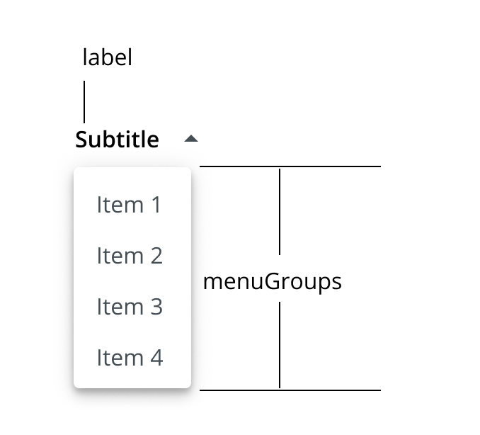

# Toolbar Menu

The `ToolbarMenu` component is used to display a dropdown menu with label, primarily inside of `<Toolbar>` or Card Header elements. The Menu can be populated via the `menuGroups` prop, or can be entirely customized by supplying your own `<Menu>` via the `menu` prop.

## Usage

<div style="width: 100%; text-align: center">
    
</div>

```tsx
import { ToolbarMenu } from '@brightlayer-ui/react-components';
...
<ToolbarMenu
    label={'label'}
    menuGroups={[
      {
        items: [{
            title: "Menu Item 1";
            onClick: () => {};
          },
          {
            title: "Menu Item 2";
            onClick: () => {};
          },
        ]
      }
    ]}
/>
```

## API

<div style="overflow: auto;">

| Prop Name  | Description                                  | Type                  | Required | Default |
| ---------- | -------------------------------------------- | --------------------- | -------- | ------- |
| classes    | Style Overrides                              | `ToolbarMenuClasses`  | no       |         |
| icon       | The inline icon to display                   | `JSX.Element`         | no       |         |
| label      | Custom content for label text / icon + label | `ReactNode`           | yes      |         |
| menu       | Custom content to be displayed in the menu   | Material-UI `Menu`    | no       |         |
| menuGroups | Groups of menu items to display              | `ToolbarMenuGroups[]` | no       |         |
| MenuProps  | Property overrides for the MUI Menu          | `MenuProps`           | no       |         |
| onClose    | Function called when the menu is closed      | `Function`            | no       |         |
| onOpen     | Function called when the menu is opened      | `Function`            | no       |         |

</div>

### Classes

You can override the classes used by Brightlayer UI by passing a `classes` prop. It supports the following keys:

| Name          | Description                                   |
| ------------- | --------------------------------------------- |
| dropdownArrow | Styles applied to the dropdownArrow container |
| icon          | Styles applied to the icon container          |
| label         | Styles applied to the label text              |
| root          | Styles applied to the root element            |

### Toolbar Menu Groups Object

The `menuGroups` prop of the `<ToolbarMenu>` includes many properties from the [`<DrawerNavGroup>`](https://brightlayer-ui-components.github.io/react/?path=/info/components-drawer--get-read-me-story) array found within a [`<DrawerBody>`](https://brightlayer-ui-components.github.io/react/?path=/info/components-drawer--get-read-me-story).

<div style="overflow: auto;">

| Prop Name | Description                         | Type                | Required | Default |
| --------- | ----------------------------------- | ------------------- | -------- | ------- |
| fontColor | The color used for the text         | `string`            | no       |         |
| iconColor | The color used for icons            | `string`            | no       |         |
| items     | List of navigation items to render  | `ToolbarMenuItem[]` | yes      |         |
| title     | Text to display in the group header | `string`            | no       |         |

</div>

### Toolbar Menu Item Object

<div style="overflow: auto;">

| Attribute   | Description                         | Type          | Required | Default |
| ----------- | ----------------------------------- | ------------- | -------- | ------- |
| chevron     | Show chevron icon to the right      | `boolean`     | no       | false   |
| divider     | Show a divider line below the item  | `boolean`     | no       |         |
| icon        | A component to render for the icon  | `JSX.Element` | no       |         |
| onClick     | A function to execute when clicked  | `function`    | no       |         |
| statusColor | Status stripe and icon color        | `string`      | no       |         |
| subtitle    | The text to show on the second line | `string`      | no       |         |
| title       | The text to show on the first line  | `string`      | yes      |         |

</div>
